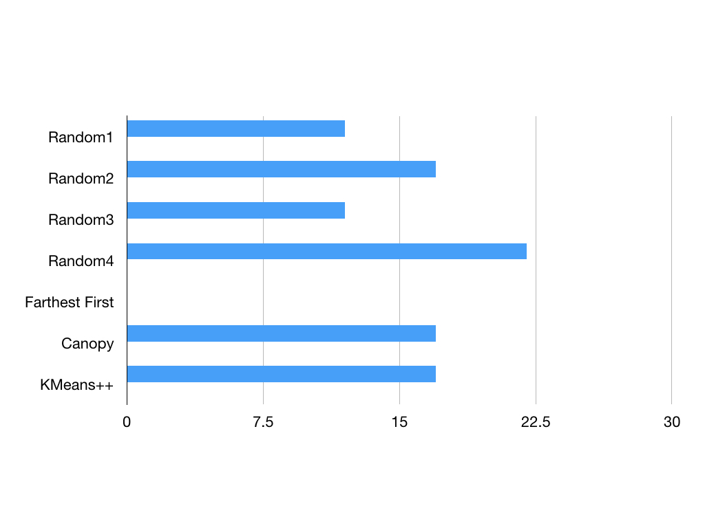
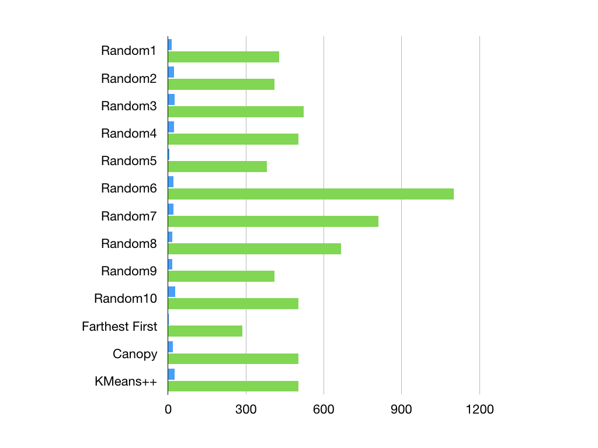
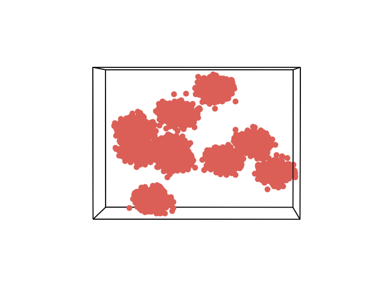
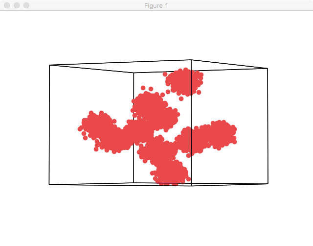
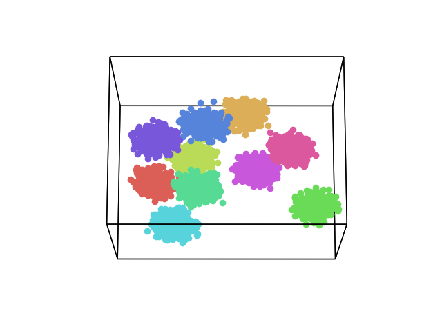
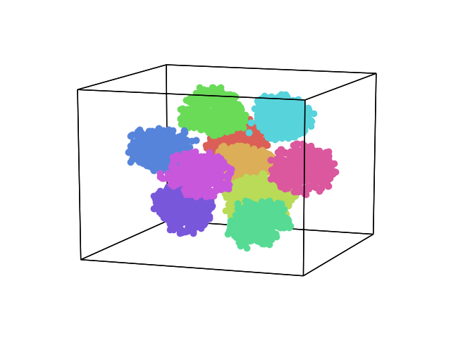

# 实验内容

1.    采用K均值算法对给定数据集合进行聚类，给出聚类结果，并与真实数据分布对比，判断聚类准确度。改变K的数值，研究K值改变与聚类准确度之间的关系。改变初始簇心，研究簇心变化与聚类准确度之间的关系。

2.    请在实验报告中给出你的模型结果，并给出解释。


# 实验过程

##聚类过程

### 数据预处理阶段

​	实验所给的数据并不能直接拿来使用，因为里面含有一些诸如最终的簇中心点坐标和簇的个数信息，如下图所示


因此需要对其进行数据预处理，删除了该数据表格中的标黄的右侧表格和簇标识列以及序号列，得到如图所示的数据文件。


另外，如果实验数据不规范还需要对其进行规范化，如其中的实验数据中有某个属性值为空也需要对其进行填补，不过在该实验数据下不需要进行这类的操作。随后将该文件保存为.csv文件，csv文件的内部格式如图所示


可以看到csv格式的文件是用逗号分隔的，最上面的一行为属性的名字，随后接下来的若干行即为实验数据。

​	通过对实验数据的总结得到如图所示的簇标识对应的个数，如图所示


​	可以看到实际上总共的十个簇，每个簇的个数都是500个，因此可以通过这个角度进行衡量，来体现聚类的准确度。

### 聚类实验阶段

通过weka导入数据，如图所示


选择上述的Cluster标签，并选择SimpleKMeans算法进行聚类分析。如图所示


### 初始化方法带来的影响分析

​	由于根据实验中给定的原始数据已经表明簇的个数为10个，因此可以先从簇为10个的情况开始,其它条件保持不变的情况下先进行聚类实验。在该模式下进行分析能够得到聚类中的点的个数，如下所示

> 0      1000 ( 20%)
> 1       500 ( 10%)
> 2       500 ( 10%)
> 3       500 ( 10%)
> 4       500 ( 10%)
> 5       500 ( 10%)
> 6       500 ( 10%)
> 7       245 (  5%)
> 8       500 ( 10%)
> 9       255 (  5%)

​	由于在聚类的个数为10的时候有实验数据提供的标准聚类个数，因此我们引入了一个公式计算得到的值与实际值的区别，公式如下
$$
\sqrt{\sum({B_{i}-A_{i})^{2}}}/total
$$
​	在Excel表格中输入相应的公式并得到如图所示结果


​	可以得到偏差值为12%左右。由于目前所使用的初始点选取是Random的，所以多次跑的时候可能得到不同的结果，(由于weka是伪随机所以通过修改seed的值来修改初始点)。

​	


​	可以看出Random下的误差还是比较大的并且随着初始簇心的位置不同带来的结果影响也是非常大的，因此在该数据下，合理的选取簇新对与良好的聚类具有比较重要的影响。

​	随后我们更换别的initialzationMethod进行聚类。

​	首先我们选取Farthest First算法作为初始类簇中心点,然后选择距离该店最远的那个店作为第二个初始类簇中心点，如此类推。运行结果得到偏差值为0%，所以就簇中的平均点数而言，该初始化方法是最好的。

​	随后采取Canopy算法进行尝试，该算法是通过定义两个距离T1,T2，并假定T1>T2，通过从初始的点集合中随机移除一个点P，然后对于仍然在S中的每一个点进行遍历计算P与集合中的点的距离，如果该距离小于T1，则将该店加入到P代表的Canopy中，如果距离小于T2，则将该点从集合S中移除，并将该店加入到P所代表的Canopy中，随后迭代该过程。在默认的CanopyT1和CanopyT2值中，我们发现最终的运行结果的偏差为17%,可以看到默认情况下的偏差值较高，在多次进行调整后发现仍然较高，因此该方法并不适用于该数据集。

​	最后采取了Kmeans++的方法，该方法是对Kmeans算法的一个改进，简单的说该方法下选择聚类的中心是在输入向量中随机选取，并且选取新的簇初始点会更有可能的选取与已经选取的簇中心点的位置相异。通过运行该算法得到偏差为17%，同样较高。

​	因此在对于该数据的情况下，可以发现最好的初始化方法是Farthest First，当然这并不代表别的初始化方法就有缺陷，只能说对于该输入数据而言该方法是最优解。


#### 错误数和迭代次数分析

在weka中的SimpleKMeans将initializationMethod调至Random算法，通过改变seed来获取不同的初始簇心，观察在聚类类数相同的情况下，改变初始簇心的选择，kmeans的聚类结果的情况。

以下为在聚类个数为10类的条件下，选取10次不同初始簇心来进行聚类后的迭代次数和错误数的结果。

​	


​	由实验结果看来，Random方法的迭代次数分布在5-28之间，错误率大部分在400-500之间，并且迭代次数和错误率之间无必然联系，而同时可以看出，在初始簇心选择较好的情况下（如图中选取的Farthest First ），迭代次数和错误率会相应减少，因此综合分析可以认为kmeans算法是对初始簇心的选取是敏感的。

#### kmeans算法对聚类类数k的敏感性

​	为了尽可能使其他条件保持一致，观察到用farthest first算法生成的初始聚类中心较稳定，于是用farthest first算法来生成初始簇心，观察类数k值从3逐步加到15的聚类结果，以迭代次数和错误率作为敏感度的评价标准，认为错误率越低，聚类的结果越准确。以下是通过在weka中调整参数k为3-15所获得的聚类结果中迭代次数和错误率的表格。

​	


​	


​	为了更直观的表达聚类的效果，通过两个折线图来展示。很明显可以看出，随着cluster num的增加，错误率逐步趋近于270-280之间，迭代次数在cluster number超过10以后骤然上升到35次。可以认定，在初始质心稳定的情况下，随着cluster num的增加，聚类结果的错误率会减少并趋于一个值，迭代次数会相应的增加，最佳的cluster number值是选择错误数在稳定值范围内并且迭代次数最少的值，在本次试验中，选择cluster number = 10为最佳聚类数。

## 使用HyperTools进行数据可视化

​	由于该数据为高维数据，因此要想在最多三维空间里绘制该类型的可视化信息，需要对该数据进行降维。降维是指把高维数据集转化为低维数据集。做降维，**最简单的方法是忽略某些特征。**比如挑出你最喜欢的三个特征，去掉其他。但如果忽略的特征包含有价值的甄别信息，这就非常有问题了。

​	一个更复杂的办法，是只考虑主要的东西，来对数据集进行降维。**即将特征进行合并，用合并后的主成分来解释数据集中的大多数变化。**利用一项名为主成分分析（PCA）的技术，我们能够在降维的同时，尽可能保留数据集的宝贵变化。这里的思路是，我们能够创建一系列（更少）新的特征，每一项新特征都由几项旧特征合并得到。举个例子，就对于蘑菇其中一项新特征也许会同时代表形状和颜色，另一项代表尺寸和毒性。大体上，每一项新特征都会由原始特征的加权和得到。

​	假设你有一个三维数据集（左），你想要把它转化为右边的二维数据集。PCA 会在原始 3D 空间找出主要的坐标轴，即点与点之间的差别最大。当我们把两条最能解释数据差异的坐标轴确定下来（左图中的黑线），就可以在这两条坐标轴上重新为数据作图。3D 数据集现在就变成了 2D 的。这里，我们选择的是低维例子，所以我们能看到发生了什么。但是，这项技术能用同样的方式应用于高维数据集。

​	

​	

```python
import pandas as pd
import hypertools as hyp
data = pd.read_csv('data.csv')
data.head()
属性1  属性2  属性3  属性4  属性5  属性6  属性7  属性8  属性9  属性10
0   88   92  119  103   23   93   55   50   22    21
1  104   92   46   34   90  106   99   32   21    34
2   55   30   54   22   39   67    8   89   55    32
3   16  116   19   63   41   24  101   71   24   100
4   55   74   89  123   60  114   70   40   47    99
hyp.plot(data,'o')
```

得到如图所示的图





可以从多个维度数出总共的簇个数刚好为10个，符合聚类数据中所给的最优簇的个数，因此这种方式对该类数据是有效的。

​	在绘制  DataFrame 上，我们实际上创建了一个三维的空间。具有相似特征的簇，是空间中距离相近的点，特征不同的，则距离更远。用这种方式做 DataFrame 可视化，一件事马上变得很清楚：数据中有多组簇。换句话说，簇特征的所有组合并不是等可能的（equally likely），而特定的组合，会倾向于聚到一起。我们可以借助 HyperTools 的“聚类”功能，对此进一步探索。它使用了 k-means 聚类方法对观察值上色。数据集的描述表明其有 10种不同种类的簇，因此，我们把n _clusters 参数设为 10。

```python
hyp.plot(data, 'o', n_clusters=10)
```




可以看到不同的簇上的点都被标上了不同的颜色，更清楚的看出来了簇的分布。当然，默认情况下该工具是使用PCA降维的，该方法是一个线性的无监督的全局算法，其核心思想为在降维之后能够最大化保持数据的内在信息，通过衡量在投影方向上的数据方差的大小来衡量该方向的重要性。

​	由于PCA是线性的算法，效果比较一般，因此随后我们换种降维算法t-SNE,t-SNE 是一种非线性降维算法，非常适用于高维数据降维到2维或者3维，进行可视化。t-SNE主要包括两个步骤：第一、t-SNE构建一个高维对象之间的概率分布，使得相似的对象有更高的概率被选择，而不相似的对象有较低的概率被选择。第二，t-SNE在低维空间里在构建这些点的概率分布，使得这两个概率分布之间尽可能的相似（这里使用KL散度（Kullback–Leibler divergence）来度量两个分布之间的相似性）。

```python
from sklearn.manifold import TSNE
TSNE_model = TSNE(n_components=3)
reduced_data_TSNE = TSNE_model.fit_transform(hyp.tools.df2mat(data))
hyp.plot(reduced_data_TSNE,'o',n_clusters=10)
```


​	t-SNE跑该数据的时间相较于PCA要久得多，其结果如图。

​	

可以看到对于该类数据而言，其实两种算法跑出来的结果是相似的，都可以看出实际上的10个簇。

### 总结

- 聚类结果与初始簇中心选择有密切关系，通过选择不同的簇中心，可能得到不同的聚类结果。对于低维数据而言，可以先通过对其进行数据可视化观察找出数据的分布特征，再根据这些特征找到对应的适应于该分布的聚类方法
- 聚类结果与聚类类数k有关，不同的聚类类数可能导致类中的数据点间距过大，聚类结果不好。而且通过上述的分析可以发现，聚类结果随着聚类类数的增加，其错误数会先迅速下降，再进过一个较为平缓的下降，最后趋于稳定。另外，对于迭代次数而言，如果聚类类数太高，反而会导致迭代次数迅速增加，反而是通过不断的改变聚类类数k值，可以找到一个较低的迭代次数的聚类结果。因此，在没有具体要求聚类类数k的时候，可以通过对错误数和迭代次数的观察，找到一个局部最优的聚类类数k值。实际上，也可以通过实际工程需求对这两个参数附上权值并通过迭代寻找的方式找到最优解。
- 通过对数据进行可视化可以让我们更好的了解数据的特征，让我们能够根据数据的特征寻找适应于该类数据的算法。同时，对于如实验提供的数据这种较为规整的数据，我们可以通过数据可视化预判大致的簇个数，减少大量的重复测试操作，并直接在相应的簇的个数下进行聚类分析。
- 以上的结论都是基于该数据推导出来的结果，对于不同的数据可能产生不同的结果，需要通过经验和实际工程考虑解决问题。


### 附录

表格一：不同初始化条件下的偏差程度表格


| Iteration      | Differences | Seed  |
| -------------- | ----------- | ----- |
| Random1        | 12%         | 10    |
| Random2        | 17%         | 100   |
| Random3        | 12%         | 1000  |
| Random4        | 22%         | 10000 |
| Average        | 15%         |       |
| Farthest First | 0%          | 10    |
| Canopy         | 17%         | 10    |
| KMeans++       | 17%         | 10    |


| 实验次数           | 迭代次数 | 错误率     |
| -------------- | ---- | ------- |
| Random1        | 13   | 428.5   |
| Random2        | 23   | 410.55  |
| Random3        | 25   | 521.6   |
| Random4        | 22   | 502.8   |
| Random5        | 5    | 380.6   |
| Random6        | 21   | 1100.35 |
| Random7        | 20   | 809.93  |
| Random8        | 17   | 666.84  |
| Random9        | 15   | 410.59  |
| Random10       | 28   | 502.1   |
| Farthest First | 3    | 286.01  |
| Canopy         | 18   | 502.20  |
| KMeans++       | 24   | 502.59  |


| cluster num | 迭代次数 | 错误率     |
| ----------- | ---- | ------- |
| 3           | 8    | 2206.07 |
| 4           | 9    | 1950.47 |
| 5           | 7    | 1372.2  |
| 6           | 7    | 1090.68 |
| 7           | 22   | 749.93  |
| 8           | 4    | 507.57  |
| 9           | 3    | 380.61  |
| 10          | 3    | 286.01  |
| 11          | 35   | 283.41  |
| 12          | 35   | 280.69  |
| 13          | 35   | 277.9   |
| 14          | 35   | 275     |
| 15          | 35   | 272.61  |

