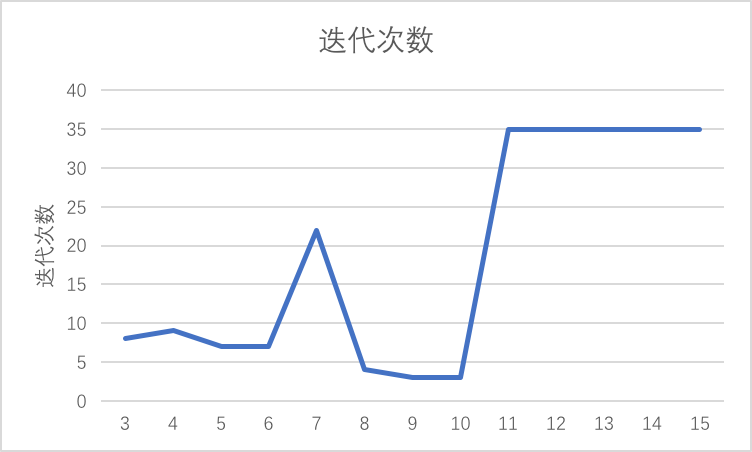
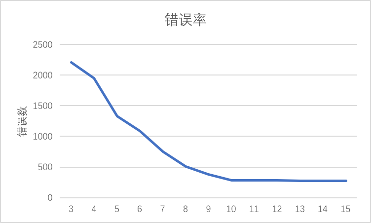

## 实验内容

1.    采用K均值算法对给定数据集合进行聚类，给出聚类结果，并与真实数据分布对比，判断聚类准确度。改变K的数值，研究K值改变与聚类准确度之间的关系。改变初始簇心，研究簇心变化与聚类准确度之间的关系。

2.    请在实验报告中给出你的模型结果，并给出解释。

## 实验过程

### 数据预处理阶段

​	实验所给的数据并不能直接拿来使用，因为里面含有一些诸如最终的簇中心点坐标和簇的个数信息，如下图所示

因此需要对其进行数据预处理，删除了该数据表格中的标黄的右侧表格和簇标识列以及序号列，得到如图所示的数据文件。

另外，如果实验数据不规范还需要对其进行规范化，如其中的实验数据中有某个属性值为空也需要对其进行填补，不过在该实验数据下不需要进行这类的操作。随后将该文件保存为.csv文件，csv文件的内部格式如图所示

可以看到csv格式的文件是用逗号分隔的，最上面的一行为属性的名字，随后接下来的若干行即为实验数据。

​	通过对实验数据的总结得到如图所示的簇标识对应的个数，如图所示

​	可以看到实际上总共的十个簇，每个簇的个数都是500个，因此可以通过这个角度进行衡量，来体现聚类的准确度。

### 聚类实验阶段

通过weka导入数据，如图所示

选择上述的Cluster标签，并选择SimpleKMeans算法进行聚类分析。

由于实验中给定的原始数据已经表明簇的个数为10个，因此可以先从簇为10个的情况开始，通过设定

### kmeans算法对聚类类数k的敏感性

为了尽可能使其他条件保持一致，观察到用farthest first算法生成的初始聚类中心较稳定，于是用farthest first算法来生成初始簇心，观察类数k值从3逐步加到15的聚类结果，以迭代次数和错误率作为敏感度的评价标准，认为错误率越低，聚类的结果越准确。以下是通过在weka中调整参数k为3-15所获得的聚类结果中迭代次数和错误率的表格。

| cluster  num | 3       | 4       | 5      | 6       | 7      | 8      | 9      | 10     | 11     | 12     | 13    | 14     | 15     |
| ------------ | ------- | ------- | ------ | ------- | ------ | ------ | ------ | ------ | ------ | ------ | ----- | ------ | ------ |
| 迭代次数         | 8       | 9       | 7      | 7       | 22     | 4      | 3      | 3      | 35     | 35     | 35    | 35     | 35     |
| 错误率          | 2206.07 | 1950.47 | 1327.2 | 1090.68 | 749.93 | 507.57 | 380.61 | 286.01 | 283.41 | 280.69 | 277.9 | 275.24 | 272.61 |

为了更直观的表达聚类的效果，通过两个折线图来展示。很明显可以看出，随着cluster num的增加，错误率逐步趋近于270-280之间，迭代次数在cluster number超过10以后骤然上升到35次。可以认定，在初始质心稳定的情况下，随着cluster num的增加，聚类结果的错误率会减少并趋于一个值，迭代次数会相应的增加，最佳的cluster number值是选择错误数在稳定值范围内并且迭代次数最少的值，在本次试验中，选择cluster number = 10为最佳聚类数。