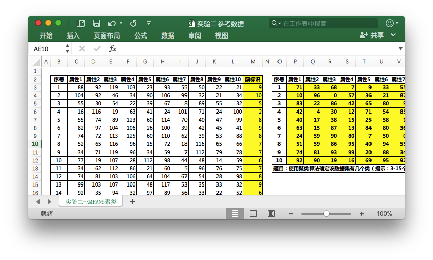
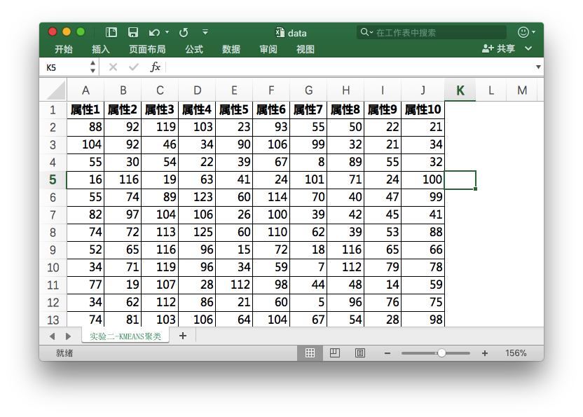
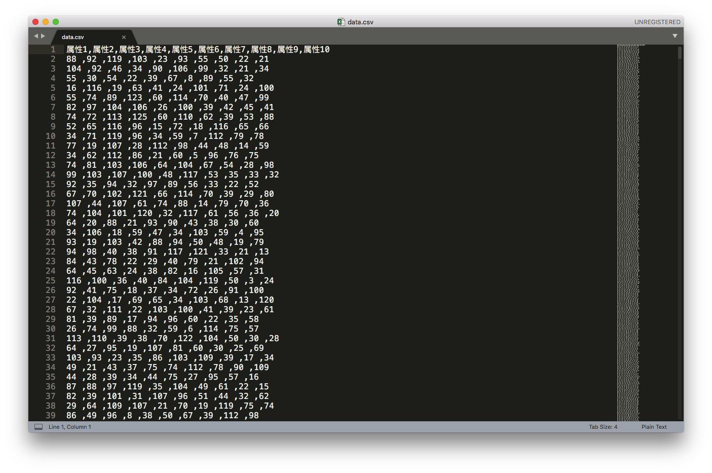
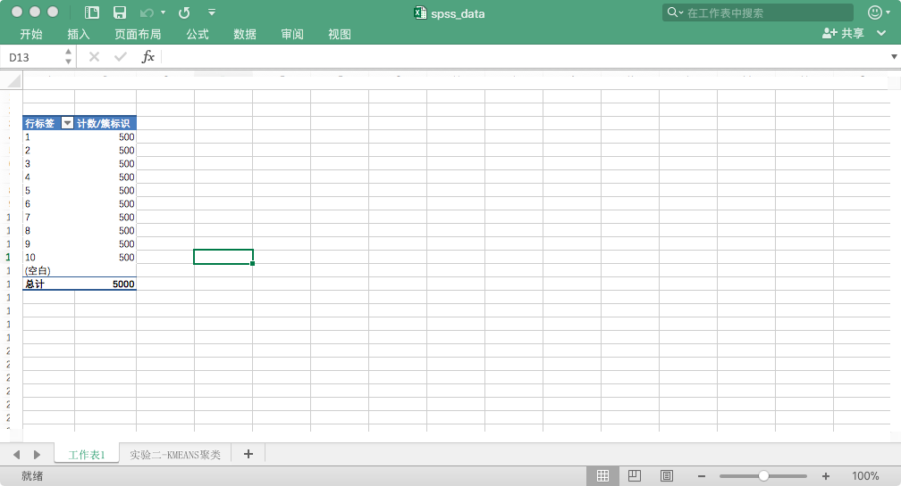
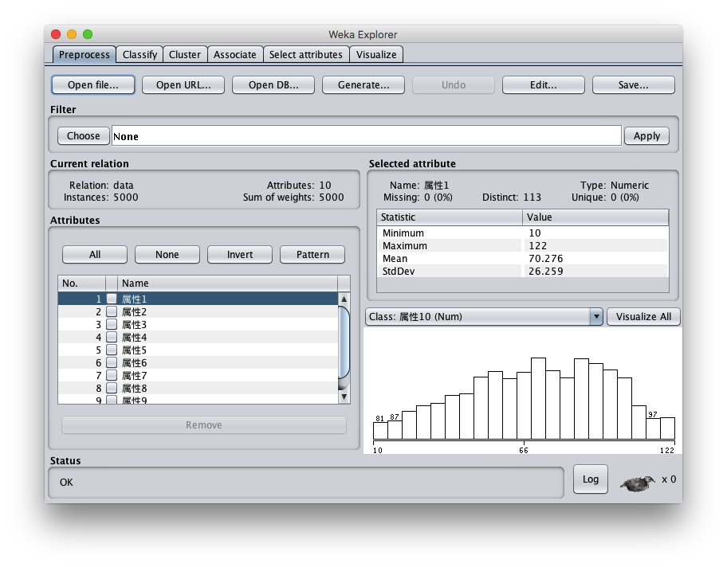
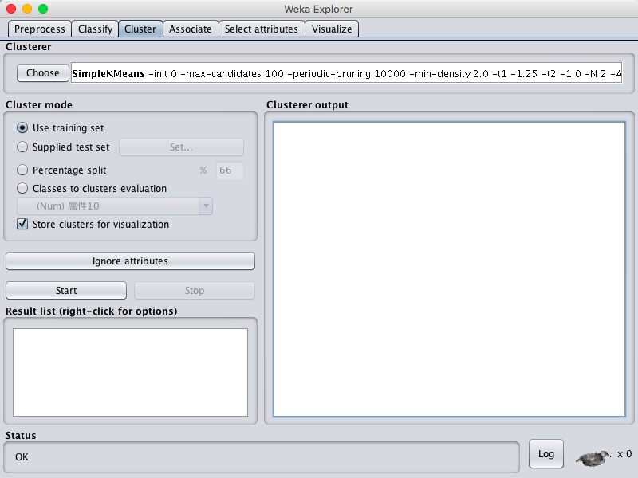

## 实验内容

1.    采用K均值算法对给定数据集合进行聚类，给出聚类结果，并与真实数据分布对比，判断聚类准确度。改变K的数值，研究K值改变与聚类准确度之间的关系。改变初始簇心，研究簇心变化与聚类准确度之间的关系。

2.    请在实验报告中给出你的模型结果，并给出解释。

## 实验过程

### 数据预处理阶段

​	实验所给的数据并不能直接拿来使用，因为里面含有一些诸如最终的簇中心点坐标和簇的个数信息，如下图所示

因此需要对其进行数据预处理，删除了该数据表格中的标黄的右侧表格和簇标识列以及序号列，得到如图所示的数据文件。

另外，如果实验数据不规范还需要对其进行规范化，如其中的实验数据中有某个属性值为空也需要对其进行填补，不过在该实验数据下不需要进行这类的操作。随后将该文件保存为.csv文件，csv文件的内部格式如图所示

可以看到csv格式的文件是用逗号分隔的，最上面的一行为属性的名字，随后接下来的若干行即为实验数据。

​	通过对实验数据的总结得到如图所示的簇标识对应的个数，如图所示

​	可以看到实际上总共的十个簇，每个簇的个数都是500个，因此可以通过这个角度进行衡量，来体现聚类的准确度。

### 聚类实验阶段

通过weka导入数据，如图所示

选择上述的Cluster标签，并选择SimpleKMeans算法进行聚类分析。如图所示

#### 初始化方法带来的影响分析

​	由于根据实验中给定的原始数据已经表明簇的个数为10个，因此可以先从簇为10个的情况开始,其它条件保持不变的情况下先进行聚类实验。在该模式下进行分析能够得到聚类中的点的个数，如下所示

> 0      1000 ( 20%)
> 1       500 ( 10%)
> 2       500 ( 10%)
> 3       500 ( 10%)
> 4       500 ( 10%)
> 5       500 ( 10%)
> 6       500 ( 10%)
> 7       245 (  5%)
> 8       500 ( 10%)
> 9       255 (  5%)

​	由于在聚类的个数为10的时候有实验数据提供的标准聚类个数，因此我们引入了一个公式计算得到的值与实际值的区别，公式如下
$$
\sqrt{\sum({B_{i}-A_{i})^{2}}}/total
$$
​	在Excel表格中输入相应的公式并得到如图所示结果

​	可以得到偏差值为12%左右。由于目前所使用的初始点选取是Random的，所以多次跑的时候可能得到不同的结果，(由于weka是伪随机所以通过修改seed的值来修改初始点)在运行了好几次后得到的结果如下

| Iteration | Differences | Seed  |
| --------- | ----------- | ----- |
| 1         | 12%         | 10    |
| 2         | 17%         | 100   |
| 3         | 12%         | 1000  |
| 4         | 22%         | 10000 |
| Average   | 15%         |       |

​	可以看出Random下的误差还是比较大的并且随着初始簇心的位置不同带来的结果影响也是非常大的，因此在该数据下，合理的选取簇新对与良好的聚类具有比较重要的影响。

​	随后我们更换别的initialzationMethod进行聚类。

​	首先我们选取Farthest First算法作为初始类簇中心点,然后选择距离该店最远的那个店作为第二个初始类簇中心点，如此类推。运行结果得到偏差值为0%，所以就簇中的平均点数而言，该初始化方法是最好的。

​	随后采取Canopy算法进行尝试，该算法是通过定义两个距离T1,T2，并假定T1>T2，通过从初始的点集合中随机移除一个点P，然后对于仍然在S中的每一个点进行遍历计算P与集合中的点的距离，如果该距离小于T1，则将该店加入到P代表的Canopy中，如果距离小于T2，则将该点从集合S中移除，并将该店加入到P所代表的Canopy中，随后迭代该过程。在默认的CanopyT1和CanopyT2值中，我们发现最终的运行结果的偏差为17%,可以看到默认情况下的偏差值较高，在多次进行调整后发现仍然较高，因此该方法并不适用于该数据集。

​	最后采取了Kmeans++的方法，该方法是对Kmeans算法的一个改进，简单的说该方法下选择聚类的中心是在输入向量中随机选取，并且选取新的簇初始点会更有可能的选取与已经选取的簇中心点的位置相异。通过运行该算法得到偏差为17%，同样较高。

​	因此在对于该数据的情况下，可以发现最好的初始化方法是Farthest First，当然这并不代表别的初始化方法就有缺陷，只能说对于该输入数据而言该方法是最优解。

#### 错误数和迭代次数分析

在weka中的SimpleKMeans将initializationMethod调至Random算法，通过改变seed来获取不同的初始簇心，观察在聚类类数相同的情况下，改变初始簇心的选择，kmeans的聚类结果的情况。

以下为在聚类个数为10类的条件下，选取10次不同初始簇心来进行聚类后的迭代次数和错误数的结果。

| 实验次数 | 迭代次数 | 错误率     |
| ---- | ---- | ------- |
| 1    | 13   | 428.5   |
| 2    | 23   | 410.55  |
| 3    | 25   | 521.6   |
| 4    | 22   | 502.8   |
| 5    | 5    | 380.6   |
| 6    | 21   | 1100.35 |
| 7    | 20   | 809.93  |
| 8    | 17   | 666.84  |
| 9    | 15   | 410.59  |
| 10   | 28   | 502.1   |

​	

| 方法名            | 迭代次数 | 错误率    |
| -------------- | ---- | ------ |
| Farthest First | 3    | 286.01 |
| Canopy         | 18   | 502.20 |
| KMeans++       | 24   | 502.59 |

​	由实验结果看来，Random方法的迭代次数分布在5-28之间，错误率大部分在400-500之间，并且迭代次数和错误率之间无必然联系，而同时可以看出，在初始簇心选择较好的情况下（如图中选取的Farthest First ），迭代次数和错误率会相应减少，因此综合分析可以认为kmeans算法是对初始簇心的选取是敏感的。

